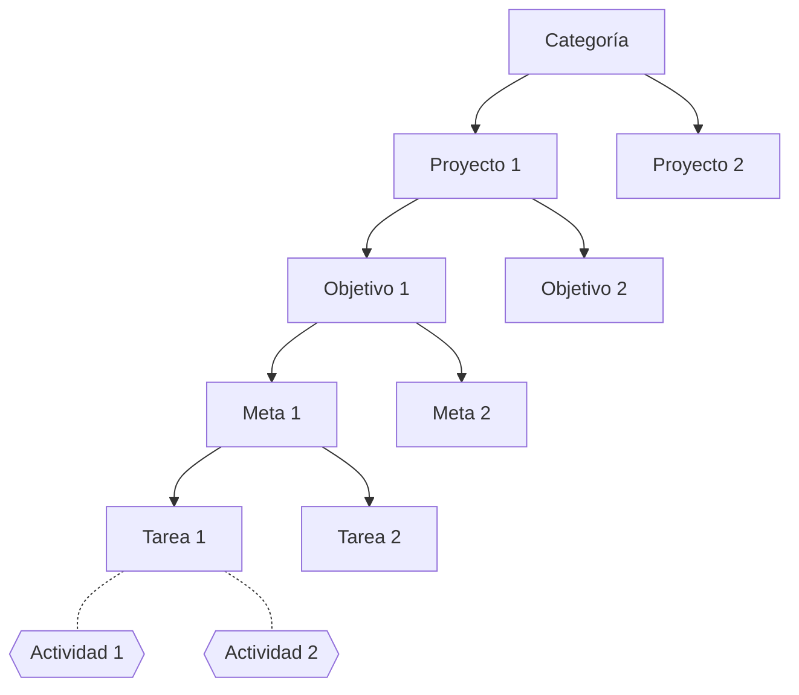

# Sistema de registro de horas de TCU

Es un sistema de:

1. **registro** de actividades
1. **clasificación** de actividades según objetivos
1. **asignación** de tareas 
1. **visualización** (*digest*) del trabajo
1. **solicitud** de gestiones administrativas
1. **información** (abierta al público) de los proyectos

**Nota**: No es un software de gestión de proyectos como Trello, Asana, etc., aunque comparte algunas características importantes y quizá pueda evolucionar hacia eso.

## 1. Registro de actividades

Son un registro de las horas de trabajo de los estudiantes. Contiene una descripción del trabajo realizado y las horas dedicadas. No es un objetivo por sí mismo.

## 2. Jerarquía de objetivos para clasificación de tareas

Cada actividad registrada está asociada con una tarea, que está asociada con la siguiente jerarquía de objetivos:

#### Ejemplo

- **Proyecto**: ferias del agricultor
- **Objetivo**: crear contenidos para la página web
- **Meta**: crear blog de información nutricional
- **Tarea**: crear un perfil nutricional del tomate
- *Actividades*:
  - Búsqueda de información en línea (actividad de 1 hora de persona X)
  - Crear infográfico (actividad de 2 horas de persona Y)
  - Encontrar una receta (actividad de 1 hora de persona Z)
  - …

La descripción de cada nivel está a continuación.

### Categorías

*Editan: profesores*

Divide los proyectos en categorías temáticas. Actualmente hay dos:

- Sistemas de información
- Talleres y material educativo

### Proyectos

*Editan: profesores*

Unidad de trabajo. Es planteada formalmente con objetivo general, objetivos específicos y demás.

### Objetivos

*Editan: profesores*

> Objetivo de primer orden

Cada uno de los objetivos específicos del proyecto, que describe un resultado entregable.

### Metas

*Editan: profesores*

> Objetivo de segundo orden

Cada una de las tareas mayores con las cuales se cumple un objetivo del proyecto.

### Tareas

*Editan: profesores y estudiantes*

> Objetivo de tercer orden

Cada una de las tareas menores (unidades mínimas de trabajo) que son necesarias para cumplir las metas del objetivo.

## 3. Asignación de tareas

Cada tarea debe tener una o más personas trabajando. Las tareas tienen varios estados: en progreso, ociosa (*idle*), terminada.

## 4. Paneles de administración

Es la componente de visualización de tareas, en forma de *digest* de la información o *dashboard* administrativo. Debe contestar a las siguientes preguntas de interés:

### Para profesores

#### Por cada proyecto, objetivo, meta o tarea

- ¿Cuántas personas y quiénes están trabajando?
- ¿Cuántas horas se han dedicado?
- ¿Cómo se distribuye el trabajo en el tiempo? (ref. GitHub)
- ¿Quién le está dedicando más tiempo? Ránking de horas por estudiante
- ¿Cuáles tienen más trabajo (tiempo) dedicado? Ránking por horas

#### Por cada estudiante

- Horas totales
- Avance del período de ejecución
- "Factor de avance" (porcentaje de horas / porcentaje de período de ejecución)
- Tareas (y metas, objetivos y proyectos) en las que está trabajando

También se puede seleccionar una categoría de estas y comparar una selección de estudiantes.

### Para estudiantes

- Horas totales
- Avance del período de ejecución
- Factor de avance (porcentaje de horas / porcentaje de período de ejecución)
- Tareas (y metas, objetivos y proyectos) en las que está trabajando

## 5. Solicitudes de gestiones administrativas

Hay dos momentos administrativamente importantes para los estudiantes durante el TCU:

- Finalización de TCU
- Solicitud de prórroga

La página permite registrar estas solicitudes para que la coordinación haga los trámites respectivos (envío de oficios a las VAS).

## 6. Páginas de proyecto

Contenido:

- Nombre
- Descripción (un texto con formato)
- Ubicación
- Categoría (link a categorías)
- Objetivo general
- Objetivos específicos (link a objetivos)
- Metas (link a metas)
- Tareas (link a tablas)
