# Horas de TCU

Sistema de registro de horas de trabajo de estudiantes en el TCU.

## Acciones por realizar

**Nota**: existen "categorías" de "proyectos", los "proyectos" están compuestos de "tareas", las "tareas" están compuestas de "actividades". Las personas docentes pueden crear categorías y proyectos, las personas docentes y estudiantes pueden crear tareas, y las personas estudiantes pueden registrar actividades ligadas con las tareas específicas.

### Estudiantes

- Registrar horas
- Revisar horas realizadas
- Hacer solicitudes de finalización o prórroga
- Revisar o crear tareas
- Enviar mensajes a profesor(a) (_baja prioridad_)

### Profesores

- Revisar y aprobar o rechazar el registro de actividades
- Consultar horas totales por estudiantes
- Consultar horas totales por tarea
- Consultar horas totales por proyecto
- Consultar horas totales por categoría de proyecto
- Crear categorías, proyectos y tareas

## Vistas de personas usuarias

### Modo estudiantes

**Menú principal**
- **Registro de actividades**: enviar para revisión una actividad, indicando el día, las horas y una descripción.
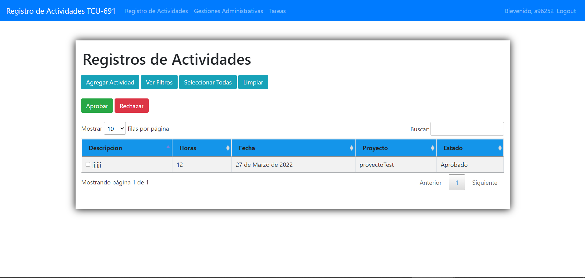
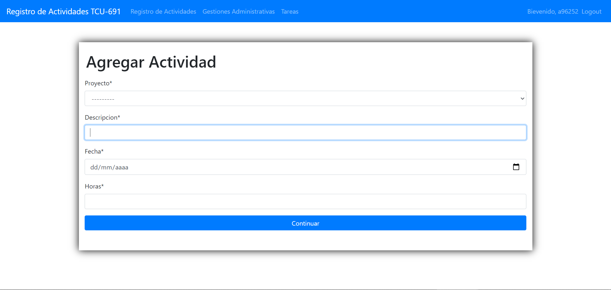
- **Gestiones administrativas**: hacer solicitudes de finalización, prórroga y corrección, explicando el motivo y adjuntando documentos si fuera necesario.

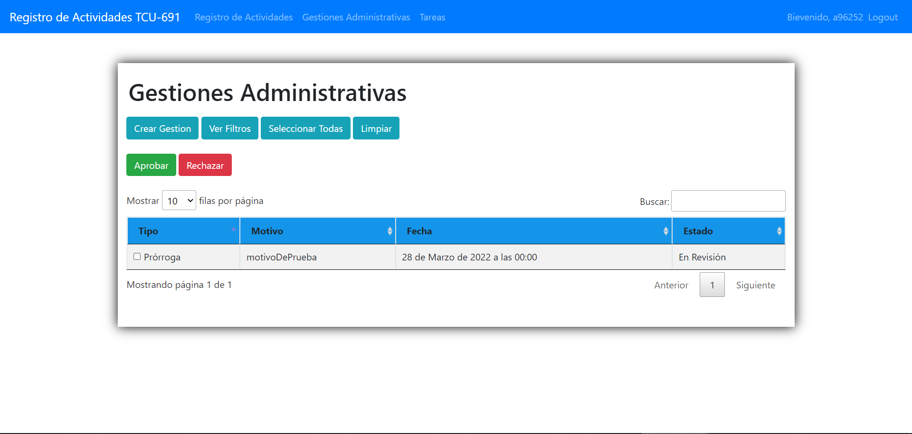

- **Tareas**: ver lista de tareas asignadas o crear una nueva.

### Modo profesores

**Menú principal**
- **Registro de actividades**: lista de todas las actividades registradas.
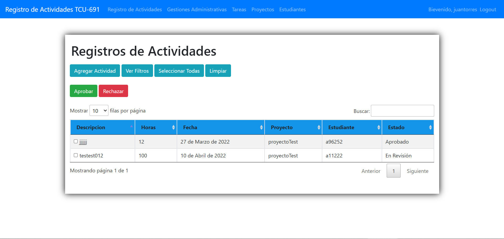
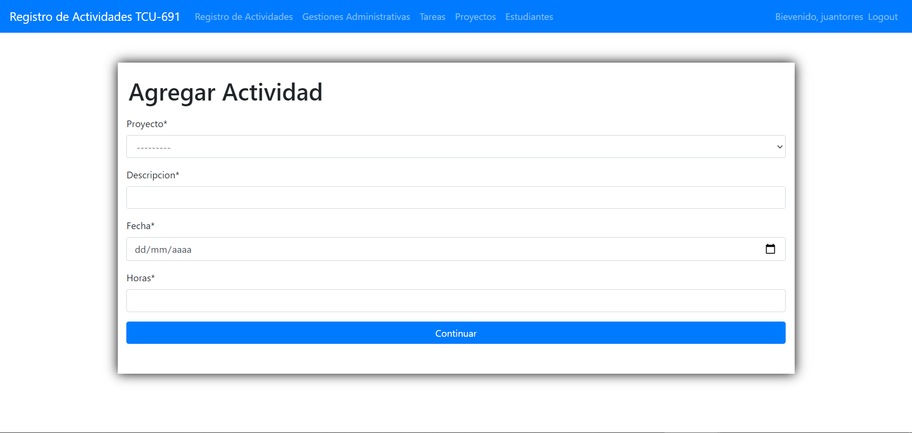
- **Gestiones administrativas**: lista de solicitudes de gestiones administrativas.
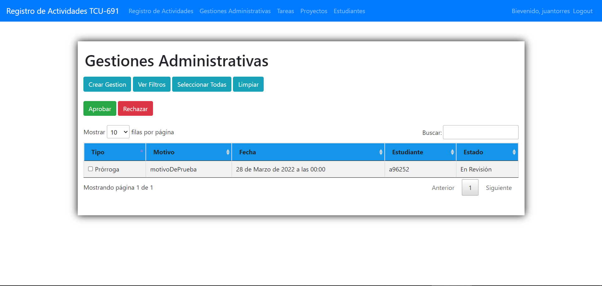

- **Tareas**: ver lista de tareas o crear una nueva con nombre, estudiante(s) asignado(s), proyecto asociado y descripción.
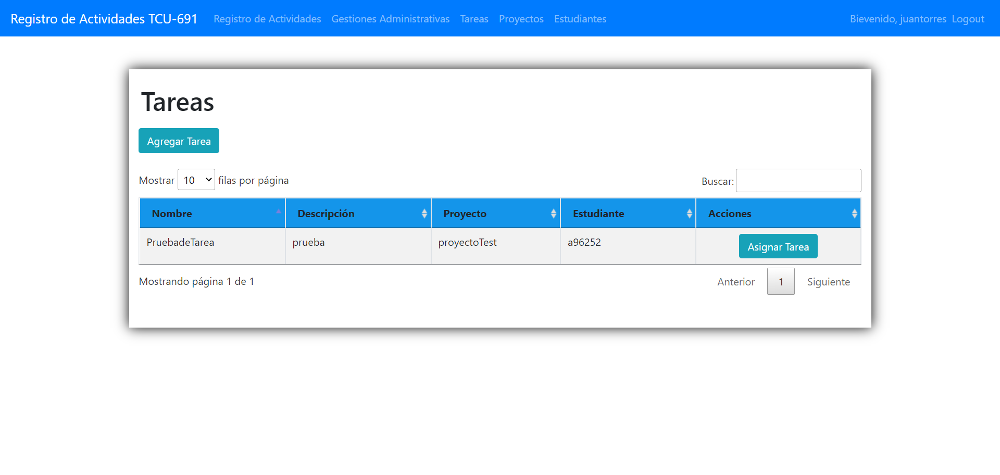
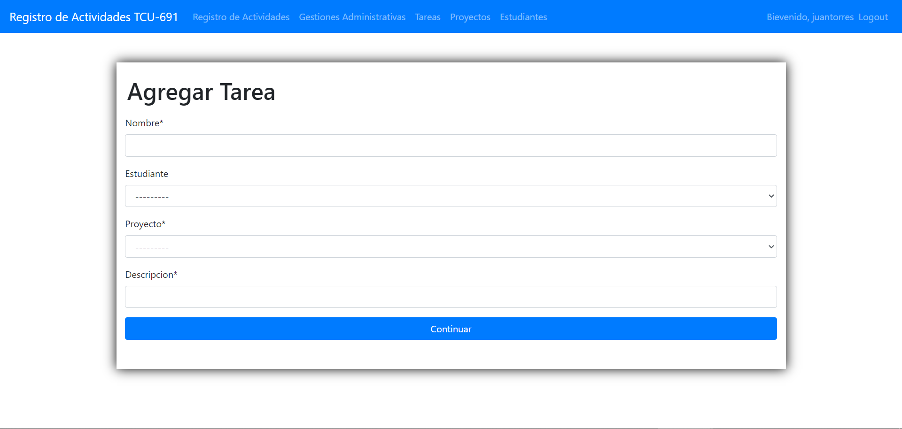
- **Proyectos**: ver lista de proyectos o crear uno nuevo con nombre, descripción, profesor asignado, categoría y ubicación.
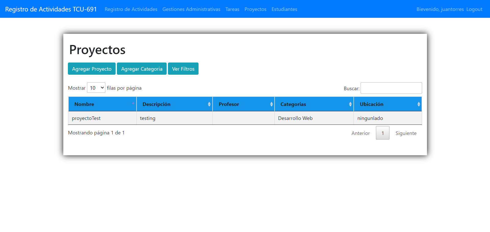
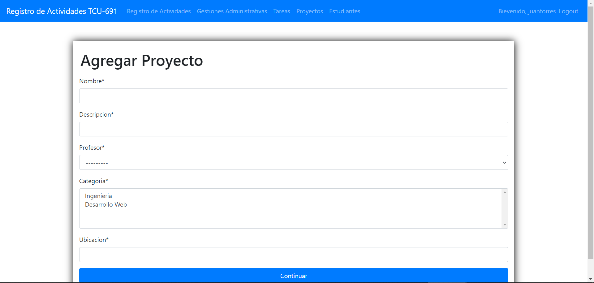
- **Estudiantes**: lista de estudiantes activos.
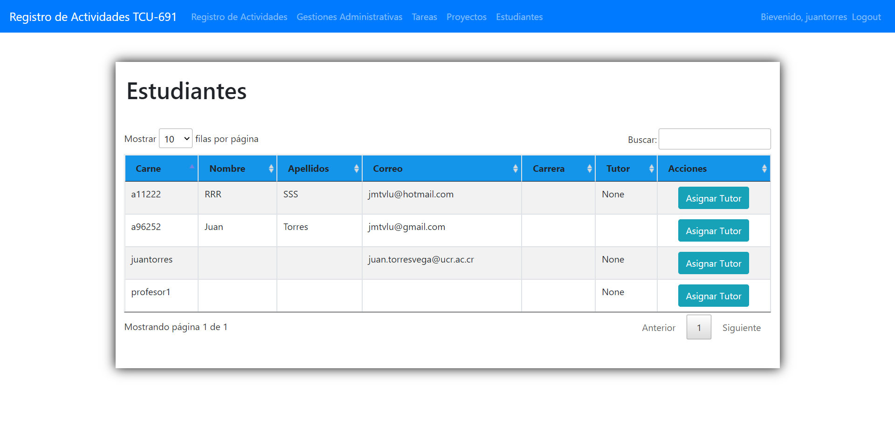

## Esbozo de modelos de la base de datos

`class Estudiante`

- Carné
- Correo
- Nombre
- Apellido
- Contraseña

`class Categoría`

- Nombre (por ejemplo: "desarrollo web", "prototipos", "talleres", "tutorías")

`class Proyecto`

- ID
- Nombre
- Descripción
- `profesor.id` (foreign key) (pueden ser varios)
- `categoria.id` (foreign key) (one to many)
- Ubicación
- Notas

`class Actividad`

- `estudiante.carné` (foreign key)
- `proyecto.id` (foreign key)
- Descripción
- Fecha
- Horas

`class Profesor`

- ID
- Correo
- Nombre
- Apellido
- Contraseña

`class Solicitud`

- `estudiante.carné` (foreign key)
- Tipo (finalización o prórroga o corrección de actividad)
- Motivo
- Fecha y hora

### Siguientes pasos (menor prioridad)

- Generación de documentos (oficios de finalización o prórroga, etc.)

## Para ejecutar el proyecto localmente

**Crear base de datos**
- Eliminar las carpetas _migrations_ en cada folder
- Eliminar _db.sqlite3_
- Ejecutar `python manage.py makemigrations`
- Ejecutar `python manage.py migrate --run-syncdb`

**Instalar dependencias**
- `python -m pip install django-crispy-forms`

**Levantar servidor**
- `python manage.py runserver`
- Ir a pagina principal servidor http://127.0.0.1:8000/cuentas/login/ o http://127.0.0.1:8000/ si logueado

