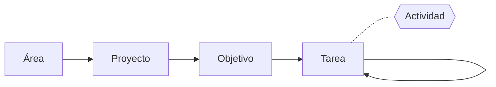
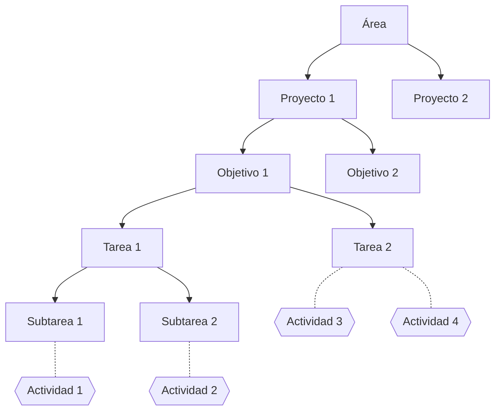
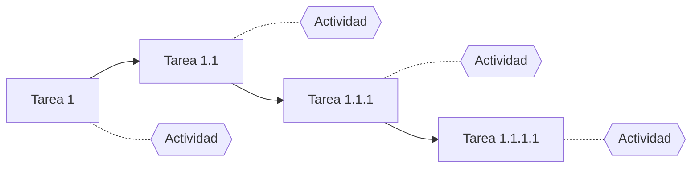
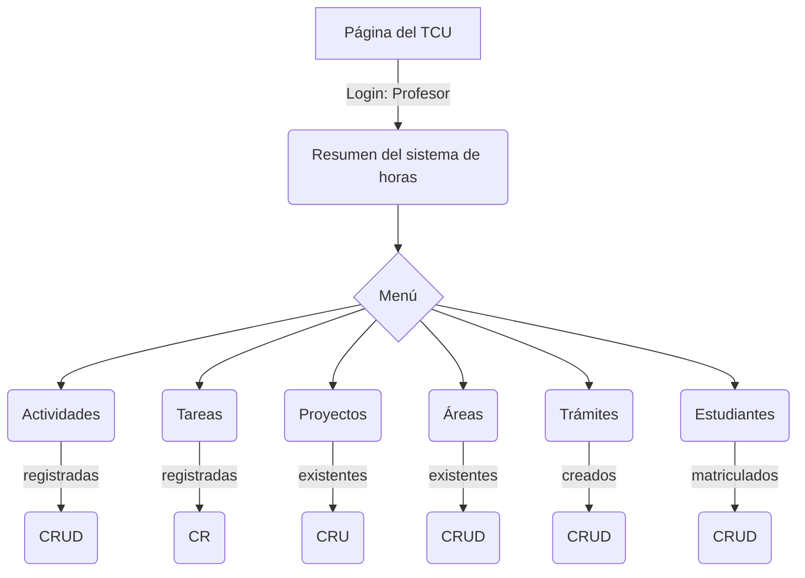
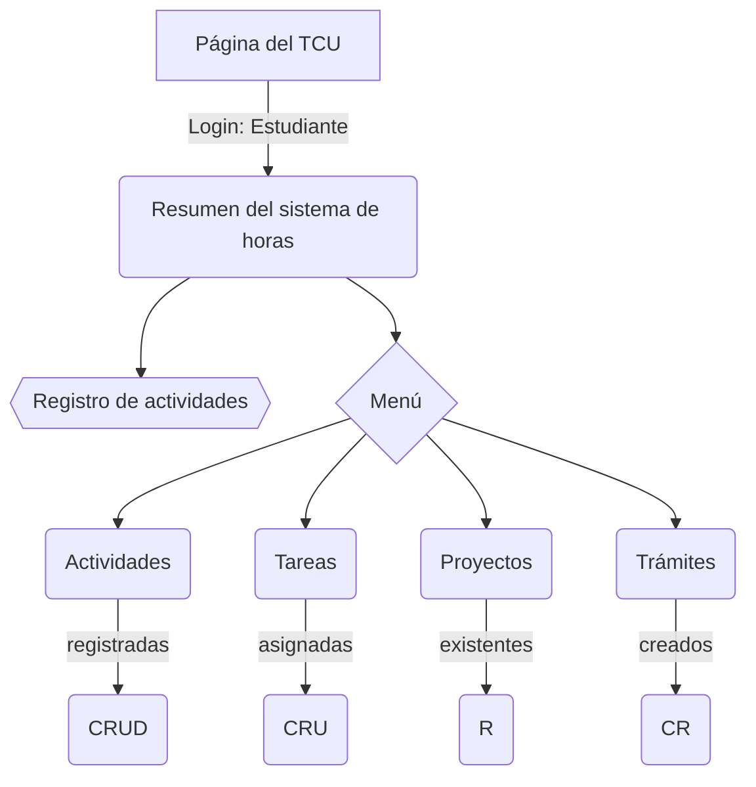
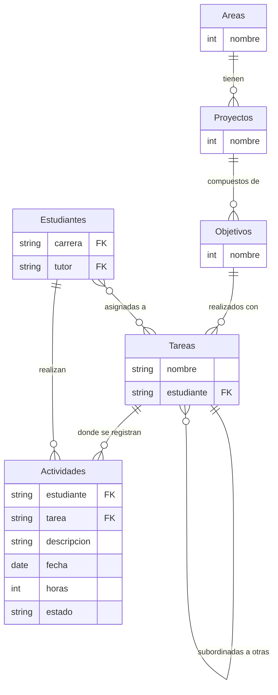

# Sistema de registro de horas de TCU

Es un sistema de:

1. **registro** de actividades
1. **clasificación** de actividades según objetivos
1. **asignación** de tareas 
1. **visualización** (*digest*) del trabajo
1. **solicitud** de gestiones administrativas
1. **información** (abierta al público) de los proyectos

**Nota**: No es un software de gestión de proyectos como Trello, Asana, etc., aunque comparte algunas características importantes y quizá pueda evolucionar hacia eso.

## 1. Registro de actividades

Son un registro de las horas de trabajo de los estudiantes. Contiene una descripción del trabajo realizado y las horas dedicadas. No es un objetivo por sí mismo.

## 2. Jerarquía de objetivos para clasificación de tareas

Cada actividad registrada está asociada con una tarea, que está asociada con la siguiente jerarquía de objetivos y tareas:

Aquí, el TCU se divide en áreas de trabajo (por ejemplo: sistemas de información y talleres educativos) en donde hay proyectos. Cada proyecto tiene objetivos. Para completar los objetivos es necesario realizar tareas, las cuales pueden agruparse en tareas relacionadas con otras tareas.

El siguiente es un ejemplo de la jerarquía de objetivos y tareas:

#### Ejemplo

- **Área**: sistemas de información
- **Proyecto**: ferias del agricultor
- **Objetivo**: crear contenidos para la página web
- **Tarea**: crear blog de información nutricional
- **Subtarea**: crear un perfil nutricional del tomate
- **Actividades**:
  - Búsqueda de información en línea (actividad de 1 hora de persona X)
  - Crear infográfico (actividad de 2 horas de persona Y)
  - Encontrar una receta (actividad de 1 hora de persona Z)
  - …

La descripción de cada nivel está a continuación.

### Áreas

- *Editan: profesores*

Divide los proyectos en áreas temáticas. Actualmente hay dos:

- Sistemas de información
- Talleres y material educativo

### Proyectos

- *Editan: profesores*

Unidad de trabajo. Es planteada formalmente con objetivo general, objetivos específicos y demás. Por ejemplo:

- Sistema de información de transporte público
- Sistema de información de ferias del agricultor

### Objetivos

- *Editan: profesores*

Cada uno de los objetivos específicos del proyecto, que describe un resultado entregable.

### Tareas

- *Editan: profesores y estudiantes*

Cada una de las tareas que son necesarias para cumplir los objetivos. Las tareas pueden subordinarse unas a otras indefinidamente y se pueden realizar actividades (registrar horas) en cada una de ellas. Por ejemplo:

### Actividades

Es la unidad mínima de trabajo, la forma en que se registran horas de TCU, pero no es una tarea por sí misma (una tarea se realiza con una o más actividades). Debe estar asociada con una tarea, que a su vez está asociada con otra tarea o con un objetivo y este con un proyecto. Por ejemplo:

- Actividad: 3 horas de reunión con la comunidad de San Gabriel, para la tarea de recopilación de historia de los buses en el pueblo, en el objetivo de creación de contenido para la página web del proyecto de sistemas de información de transporte público.

## 3. Asignación y estado de tareas

Una tarea puede tener cero, una o más personas trabajando. Las tareas tienen varios estados: en progreso, ociosa (*idle*), terminada.

## 4. Paneles de administración

Es la componente de visualización de tareas, en forma de *digest* de la información o *dashboard* administrativo. Debe contestar a las siguientes preguntas de interés:

### Para profesores

Este es el acceso que tienen las y los profesores en el sitio:

**Nota**: C (crear, *create*), R (leer, *read*), U (actualizar, *update*), D (eliminar, *delete*).

#### Por cada proyecto, objetivo, meta o tarea

- ¿Cuántas personas y quiénes están trabajando?
- ¿Cuántas horas se han dedicado?
- ¿Cómo se distribuye el trabajo en el tiempo? (ref. GitHub)
- ¿Quién le está dedicando más tiempo? Ránking de horas por estudiante
- ¿Cuáles tienen más trabajo (tiempo) dedicado? Ránking por horas

#### Por cada estudiante

- Horas totales
- Avance del período de ejecución
- "Factor de avance" (porcentaje de horas / porcentaje de período de ejecución)
- Tareas (y metas, objetivos y proyectos) en las que está trabajando

También se puede seleccionar una categoría de estas y comparar una selección de estudiantes.

### Para estudiantes

Este es el acceso que tienen las y los estudiantes en el sitio:

**Nota**: C (crear, *create*), R (ver, *read*), U (actualizar, *update*), D (eliminar, *delete*).

Y pueden conocer información como:

- Horas totales
- Avance del período de ejecución
- Factor de avance (porcentaje de horas / porcentaje de período de ejecución)
- Tareas (y metas, objetivos y proyectos) en las que está trabajando

## 5. Solicitudes de gestiones administrativas

Hay varias gestiones administras importantes para los estudiantes durante el TCU:

- Solicitud de pasantía en otro TCU
- Solicitud de finalización de TCU
- Solicitud de prórroga
- (Otros que disponga el reglamento)

La página permite registrar estas solicitudes para que la coordinación haga los trámites respectivos (envío de oficios a las VAS).

## 6. Páginas de proyectos

Son páginas de acceso público que muestran los proyectos en los que trabaja el TCU. 

Podrían tener una sección privada donde hay más estadísticas sobre el trabajo hecho en cada proyecto.

- Nombre
- Descripción (un texto con formato)
- Ubicación
- Área (link a áreas)
- Objetivo general
- Objetivos específicos (link a objetivos)
- Metas (link a metas)
- Tareas (link a tablas)
- Fotografías

# Base de datos

La base de datos está hecha con SQLite3 (por defecto en Django) que para su capacidad de almacenamiento y las demandas del sistema parece suficiente.

Para tomar en cuenta:

- Hacer respaldos regulares.
