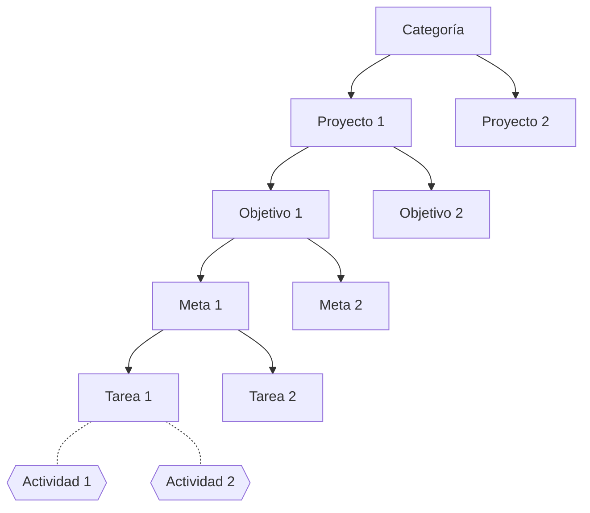

# Sistema de registro de horas de TCU

> Un sistema de información en el que las personas estudiantes pueden registrar sus actividades de TCU, dentro de los proyectos respectivos. También permite la gestión de algunas solicitudes (prórrogas, oficios de finalización) y facilita el monitoreo tanto de estudiantes como de profesores del trabajo en cada proyecto y el nivel de avance.

- Es un sistema de 
  - **registro** de actividades
  - **clasificación** de actividades
  - **asignación** de tareas 
  - **visualización** (*digest*) del trabajo
  - **solicitud** de gestiones administrativas
  - **información** (abierta al público) de los proyectos del TCU

**Nota**: No es un software de gestión de proyectos como Trello, Asana, etc. (al menos todavía no).

## Paneles de administración

### Para profesores

#### Por cada proyecto, objetivo, meta o tarea

- ¿Cuántas personas y quiénes están trabajando?
- ¿Cuántas horas se han dedicado?
- ¿Cómo se distribuye el trabajo en el tiempo? Al estilo de GitHub, tal vez
- ¿Quién le está dedicando más tiempo? Ránking de horas por estudiante

#### Por cada estudiante

- Horas totales
- Avance del período de ejecución
- "Factor de avance" (porcentaje de horas / porcentaje de período de ejecución)
- Tareas (y metas, objetivos y proyectos) en las que está trabajando
- Lista de actividades realizadas

También se puede seleccionar una categoría de estas y comparar una selección de estudiantes.

### Para estudiantes

- Horas totales
- Avance del período de ejecución
- Factor de avance (porcentaje de horas / porcentaje de período de ejecución)
- Tareas (y metas, objetivos y proyectos) en las que está trabajando
- Lista de actividades realizadas

## Jerarquía de objetivos para clasificación de tareas

#### Ejemplo

- **Proyecto**: ferias del agricultor
- **Objetivo**: crear contenidos para la página web
- **Meta**: crear blog de información nutricional
- **Tarea**: crear un perfil nutricional del tomate
- *Actividades*:
  - Búsqueda de información en línea (actividad de 1 hora de persona X)
  - Crear infográfico (actividad de 2 horas de persona Y)
  - Encontrar una receta (actividad de 1 hora de persona Z)
  - …

### Categorías

Editable solamente por profesores

Divide los proyectos en categorías temáticas. Actualmente hay dos:

- Sistemas de información (transporte público y ferias del agricultor)
- Talleres y material educativo

### Proyectos

Editable solamente por profesores

Unidad de trabajo que debe ser planteada formalmente con objetivo general y objetivos específicos.

### Objetivos

Editable solamente por profesores

> Objetivo de primer orden

Cada uno de los objetivos específicos del proyecto, que debe describir un resultado entregable.

### Metas

Editable solamente por profesores

> Objetivo de segundo orden

Cada una de las tareas mayores con las cuales se cumple un objetivo del proyecto.

### Tareas

Editable por profesores y estudiantes

> Objetivo de tercer orden

Cada una de las tareas menores (unidades mínimas de trabajo) que son necesarias para cumplir las metas del objetivo.

## Registro de actividades

Son un registro de las horas de trabajo de los estudiantes. Contiene una descripción del trabajo realizado y las horas dedicadas. No es un objetivo por sí mismo.

Cada actividad está asociada con una tarea, que está asociada con una meta, asociada con un objetivo, asociado con un proyecto.

## Páginas de proyecto

Contenido:

- Nombre
- Descripción (un texto con formato)
- Ubicación
- Categoría (link a categorías)
- Objetivo general
- Objetivos específicos (link a objetivos)
- Metas (link a metas)
- Tareas (link a tablas)
